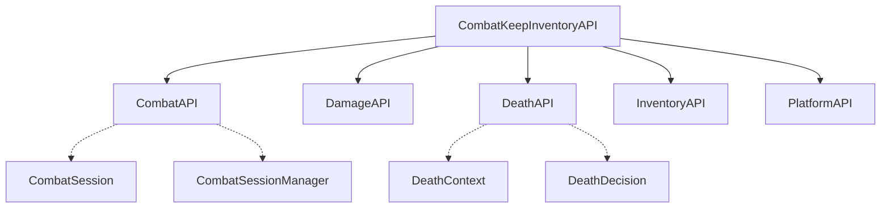
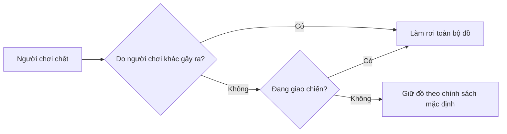

# CombatKeepInventory

CombatKeepInventory là hệ thống CombatTag (đánh dấu giao chiến) và quản lý giữ/rơi đồ khi chết cho máy chủ Minecraft.

## Mục lục

- [Plugin này làm gì?](#plugin-này-làm-gì)
- [Tích hợp vào plugin của bạn](#tích-hợp-vào-plugin-của-bạn)
- [Bản đồ API](#bản-đồ-api)
- [Combat — Trạng thái giao chiến](#combat--trạng-thái-giao-chiến)
- [Damage — Truy vết sát thương](#damage--truy-vết-sát-thương)
- [Death — Đánh giá cái chết](#death--đánh-giá-cái-chết)
- [Inventory — Chính sách giữ/rơi đồ](#inventory--chính-sách-giữrơi-đồ)
- [Platform — Thông tin nền tảng](#platform--thông-tin-nền-tảng)
- [Cơ chế mở rộng dự trù](#cơ-chế-mở-rộng-dự-trù)
- [Ví dụ nhanh](#ví-dụ-nhanh)

---

## Plugin này làm gì?

- **Đánh dấu giao chiến (CombatTag):** khi một người chơi đánh/bị đánh bởi người chơi khác, cả hai bị đánh dấu "đang giao chiến" trong một khoảng thời gian có thể cấu hình. Đánh thêm một đòn trong lúc dấu còn hiệu lực sẽ làm mới (refresh) thời gian.
- **Quyết định khi chết:** dựa trên việc người chơi có đang giao chiến hay không và ai/cái gì gây ra cái chết, plugin quyết định giữ nguyên hay làm rơi túi đồ và kinh nghiệm.
- **Nhận biết xuyên máy chủ:** nếu server của bạn nằm trong một cụm nhiều máy chủ, trạng thái giao chiến được nhận biết xuyên suốt cụm — người chơi không thể né combat bằng cách đổi server hoặc thoát mạng giữa lúc đang giao chiến.
- **Giới hạn theo vùng (tuỳ chọn):** có thể tích hợp với plugin quản lý vùng đất để giới hạn nơi được phép PvP.

Toàn bộ logic trên được điều phối qua một tầng **Core API** dùng chung — đây là tầng duy nhất bạn cần biết để tích hợp, bất kể máy chủ của bạn được thiết lập ra sao.

---

## Tích hợp vào plugin của bạn

CombatKeepInventory tự đăng ký **một thực thể API duy nhất** khi khởi động. Bạn không tự khởi tạo gì cả — chỉ cần lấy thực thể đã được đăng ký sẵn:

```java
CombatKeepInventoryAPI api = ...; // lấy thực thể đã đăng ký từ CombatKeepInventory

CombatAPI combat = api.getCombat();
DamageAPI damage = api.getDamage();
DeathAPI death = api.getDeath();
InventoryAPI inventory = api.getInventory();
PlatformAPI platform = api.getPlatform();
```

Toàn bộ 5 nhóm chức năng bên trên đều **không phụ thuộc vào việc máy chủ của bạn chạy độc lập hay trong một cụm nhiều máy chủ** — cùng một đoạn code hoạt động giống nhau ở cả hai trường hợp. Hãy khai báo CombatKeepInventory là một phụ thuộc (dependency) của plugin bạn để đảm bảo nó được nạp trước.

---

## Bản đồ API



Mỗi nhánh trong sơ đồ tương ứng với một mục bên dưới.

---

## Combat — Trạng thái giao chiến

```java
combat.isInCombat(playerId);                 // đang giao chiến hay không?
combat.getSession(playerId);                 // Optional<CombatSession> — phiên hiện tại (nếu có)
combat.startCombat(playerId);                 // bắt đầu giao chiến (không rõ đối thủ)
combat.startCombat(playerId, opponentId);     // bắt đầu giao chiến giữa 2 người chơi
combat.refreshCombat(playerId, opponentId);   // làm mới thời gian (như vừa bị đánh thêm 1 đòn)
combat.endCombat(playerId, CombatReason.ADMIN); // chủ động kết thúc, kèm lý do
combat.getSessionManager();                   // truy cập ở mức chi tiết hơn — xem bên dưới
```

Một `CombatSession` đại diện cho một lượt giao chiến:

```java
session.getState();            // xem bảng CombatState bên dưới
session.isActive();
session.isExpired();
session.getRemainingMillis();
session.getOpponentId();       // Optional<UUID>
session.getLastAttackerId();   // Optional<UUID>
session.getLastVictimId();     // Optional<UUID>
session.getEndReason();        // Optional<CombatReason> — chỉ có khi phiên đã kết thúc
session.getStartedAt();
session.getLastActivityAt();
session.getExpiresAt();
```

`combat.getSessionManager()` cho phép thao tác ở phạm vi rộng hơn một người chơi đơn lẻ:

```java
sessions.getActiveSessions();               // toàn bộ người đang giao chiến trên máy chủ
sessions.forceEndCombat(playerId, reason);   // ép kết thúc ngay, bỏ qua điều kiện thông thường
sessions.removeSession(playerId);            // xoá phiên khỏi bộ nhớ
sessions.cleanupExpiredSessions(now);
```

**`CombatState`** — trạng thái của một phiên giao chiến:

| Giá trị | Ý nghĩa |
|---|---|
| `NONE` | Chưa từng có phiên nào |
| `ACTIVE` | Đang diễn ra |
| `EXPIRED` | Tự hết hạn do quá thời gian |
| `ENDED` | Kết thúc bình thường |
| `FORCED_END` | Bị buộc kết thúc |

**`CombatReason`** — lý do một phiên giao chiến bắt đầu/kết thúc:

| Giá trị | Ý nghĩa |
|---|---|
| `PLAYER_DAMAGE` | Do gây sát thương lên người khác |
| `PLAYER_ATTACKED` | Do bị người khác tấn công |
| `TIMEOUT` | Hết thời gian |
| `PLAYER_DEATH` | Do người chơi chết |
| `PLAYER_QUIT` | Do người chơi thoát |
| `SERVER_SWITCH` | Do đổi máy chủ trong cùng cụm |
| `CLUSTER_EXIT` | Do rời khỏi cụm máy chủ |
| `ADMIN` | Do quản trị viên can thiệp |
| `SYSTEM` | Do hệ thống (ví dụ khi tắt plugin) |
| `UNKNOWN` | Không xác định |

---

## Damage — Truy vết sát thương

```java
damage.getLastDamage(playerId);   // Optional<DamageSource> — nguồn sát thương gần nhất được ghi nhận
damage.getAttributionService();   // truy cập dịch vụ phân tích đầy đủ — xem bên dưới
```

```java
attribution.resolve(victimId, rawSource);  // DamageAttributionResult — phân tích một nguồn sát thương
attribution.recordDamage(source);          // ghi nhận một nguồn sát thương (plugin của bạn có thể tự "báo" sát thương riêng)
attribution.getLastDamage(victimId);       // Optional<DamageSource>
attribution.clearDamageHistory(victimId);
attribution.clearAll();
```

`DamageSource` là một interface — plugin của bạn có thể tự tạo bằng cách cung cấp 7 giá trị sau (không có lớp dựng sẵn bắt buộc phải dùng):

```java
source.getCauseType();            // xem bảng DamageCauseType bên dưới
source.getDirectAttackerId();     // Optional<UUID> — thực thể trực tiếp gây sát thương (có thể là đạn)
source.getResponsiblePlayerId();  // Optional<UUID> — người chơi chịu trách nhiệm cuối cùng
source.getVictimId();             // Optional<UUID>
source.isPlayerCaused();
source.isIndirect();              // true nếu qua trung gian (đạn, nổ...)
source.getTimestamp();
```

`DamageAttributionResult` — kết quả phân tích một `DamageSource`:

```java
result.getVictimId();
result.getKillerId();       // Optional<UUID>
result.isPlayerCaused();
result.isDirectPvP();       // cận chiến trực tiếp giữa 2 người chơi
result.isIndirectPvP();     // qua trung gian (bắn tên, đặt TNT...)
```

**`DamageCauseType`:**

| Nhóm | Giá trị |
|---|---|
| Người chơi gây ra | `PLAYER`, `PROJECTILE` |
| Nổ / lửa | `TNT`, `EXPLOSION`, `FIRE`, `FIRE_TICK`, `LAVA` |
| Môi trường | `FALL`, `VOID`, `DROWNING`, `SUFFOCATION`, `LIGHTNING`, `STARVATION` |
| Sinh vật / hiệu ứng | `ENTITY`, `MAGIC`, `POISON`, `WITHER` |
| Khác | `UNKNOWN` |

---

## Death — Đánh giá cái chết

```java
death.createContext(playerId, damageSource);  // dựng một DeathContext từ nguồn sát thương
death.evaluate(context);                      // DeathDecision — quyết định cho ngữ cảnh này
death.getDeathService();                      // truy cập trực tiếp, có thêm process(...) — xem bên dưới
```

```java
deathService.process(context);   // DeathOutcome — kết quả cuối cùng, đã "chốt"
```

`DeathContext` mô tả đầy đủ ngữ cảnh của một cái chết:

```java
context.getDeathReason();      // xem bảng bên dưới
context.getKillerId();         // Optional<UUID>
context.getCombatSession();    // Optional<CombatSession> — có giá trị nếu đang giao chiến lúc chết
context.wasInCombat();
context.wasPlayerCaused();
context.isDirectPvP();
context.isIndirectPvP();
context.getPlatform();
context.getTimestamp();
```

`DeathDecision` là kết quả đánh giá:

```java
decision.shouldKeepInventory();
decision.getInventoryPolicy();   // xem mục Inventory bên dưới
decision.shouldKeepExperience();
decision.shouldDropExperience();
decision.getReason();            // DeathReason
decision.getRuleId();            // "pvp-combat" hoặc "default" — quy tắc nào đã được áp dụng
```

**Quy tắc mặc định** khi đánh giá một cái chết:



**`DeathReason`:**

| Giá trị | Khi nào xảy ra |
|---|---|
| `PLAYER` | Bị người chơi khác giết trực tiếp |
| `PLAYER_PROJECTILE` | Bị người chơi khác giết bằng đạn (cung, ná...) |
| `PLAYER_EXPLOSION` | Bị người chơi khác giết bằng vụ nổ |
| `ENTITY` | Bị sinh vật giết |
| `ENVIRONMENT` | Lý do môi trường khác |
| `VOID` | Rơi vào hư không |
| `FIRE` | Chết cháy |
| `LAVA` | Chết vì dung nham |
| `UNKNOWN` | Không xác định |

**`DeathOutcome`** (kết quả từ `process(...)`):

| Giá trị | Ý nghĩa |
|---|---|
| `INVENTORY_KEPT` | Giữ nguyên toàn bộ đồ |
| `INVENTORY_DROPPED` | Làm rơi đồ |
| `INVENTORY_PARTIALLY_KEPT` | Giữ một phần |

---

## Inventory — Chính sách giữ/rơi đồ

```java
inventory.getDefaultPolicy();                            // InventoryPolicy đang được cấu hình
inventory.createDecision(InventoryAction.DROP, policy);  // tự dựng một quyết định cụ thể để áp dụng
```

`InventoryPolicy` mô tả chi tiết những gì được giữ lại:

```java
policy.getAction();          // xem bảng InventoryAction bên dưới
policy.keepMainInventory();
policy.keepArmor();
policy.keepOffhand();
policy.keepHotbar();
policy.keepExperience();
policy.keepLevels();
```

**`InventoryAction`:**

| Giá trị | Ý nghĩa |
|---|---|
| `KEEP` | Giữ |
| `DROP` | Rơi |
| `PARTIAL` | Giữ một phần — chi tiết "phần nào" do `InventoryPolicy` quyết định |
| `VANILLA` | Theo hành vi gốc của Minecraft, không can thiệp |

`InventoryDecision` — kết quả từ `createDecision(...)`, gộp sẵn action + policy để dùng ngay:

```java
decision.getAction();
decision.getPolicy();
decision.keepMainInventory();
decision.keepArmor();
decision.keepOffhand();
decision.keepExperience();
```

---

## Platform — Thông tin nền tảng

```java
platform.getPlatform();                        // PlatformInfo — thông tin chi tiết
platform.supports(PlatformCapability.EVENTS);   // true/false
```

```java
info.getType();                  // xem bảng PlatformType bên dưới
info.getImplementationName();
info.getImplementationVersion();
info.getMinecraftVersion();
info.getApiVersion();
info.isProxy();
info.isBackend();
```

**`PlatformType`:** `BUKKIT`, `SPIGOT`, `PAPER`, `PURPUR`, `VELOCITY`, `UNKNOWN`

**`PlatformCapability`:** `COMBAT`, `DEATH`, `INVENTORY`, `DAMAGE_ATTRIBUTION`, `PROXY_SESSION`, `SERVER_SWITCH`, `CLUSTER_EXIT`, `PLUGIN_MESSAGING`, `EVENTS`

> Ở phiên bản hiện tại, `supports(...)` phía máy chủ proxy (nhiều máy chủ) luôn trả về `false` bất kể capability nào được truyền vào — nếu cần phân biệt hành vi theo nền tảng, hãy ưu tiên dùng `getType()` / `isProxy()` / `isBackend()`.

---

## Cơ chế mở rộng dự trù

Core có sẵn một bộ khung "hook" và các lớp sự kiện (bắt đầu/làm mới/kết thúc giao chiến, người chơi chết, đánh giá chính sách đồ) để plugin khác có thể *phản ứng* thay vì phải tự kiểm tra định kỳ. **Ở phiên bản hiện tại, bộ khung này chưa được kích hoạt** — chưa có nơi nào trong plugin khởi tạo hay gọi tới chúng. Vì vậy, cách tích hợp đúng ngay bây giờ là gọi trực tiếp các API ở trên khi cần (ví dụ: kiểm tra `isInCombat(...)` trước khi cho phép một hành động), thay vì chờ được thông báo qua sự kiện/hook.

---

## Ví dụ nhanh

**Ngăn một hành động khi người chơi đang giao chiến:**

```java
if (api.getCombat().isInCombat(player.getUniqueId())) {
    player.sendMessage("Bạn không thể làm điều này khi đang giao chiến!");
    return;
}
```

**Tự đánh giá chính sách cho một cái chết đến từ chính plugin của bạn:**

```java
DamageSource source = ...; // tự implement DamageSource cho nguồn sát thương của bạn
DeathContext context = api.getDeath().createContext(player.getUniqueId(), source);
DeathDecision decision = api.getDeath().evaluate(context);

if (decision.shouldKeepInventory()) {
    // xử lý giữ đồ theo decision.getInventoryPolicy()
}
```

**Lấy danh sách tất cả người đang giao chiến (ví dụ để hiển thị bảng điểm):**

```java
Collection<CombatSession> active = api.getCombat().getSessionManager().getActiveSessions();
```
